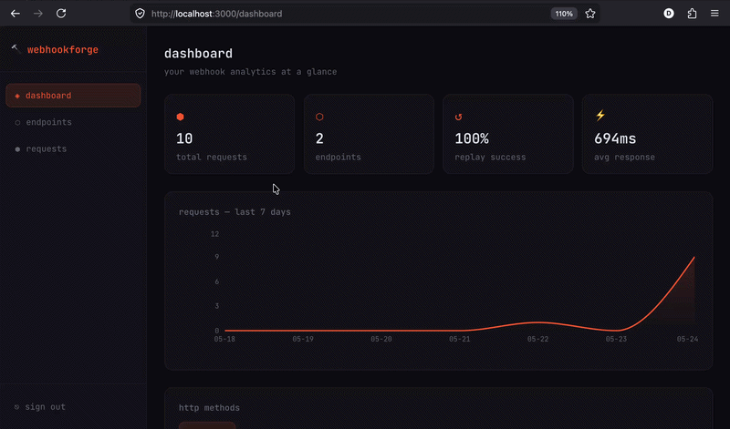

# 🔨 webhookforge

**Webhook Inspector, Replayer & Analytics Dashboard**

> Capture, inspect, replay, and analyze webhooks in real-time.
> Self-hostable alternative to RequestBin — with a proper analytics dashboard.

[](https://www.typescriptlang.org/)
[](https://nestjs.com/)
[](https://nextjs.org/)
[](https://www.postgresql.org/)
[](https://redis.io/)
[](https://www.docker.com/)
[](LICENSE)

[Live Demo](https://webhookforge.vercel.app) · [API Docs](https://webhookforge-api.onrender.com/api) · [Report Bug](https://github.com/DIYA73/webhookforge/issues)

---



---

## ✨ Features

- 🎯 **Unique Endpoints** — generate isolated webhook URLs per project
- ⚡ **Real-time Capture** — see incoming requests live via WebSocket
- 🔁 **Replay Engine** — resend any webhook to any target URL with retry logic (BullMQ)
- 📊 **Analytics Dashboard** — requests over time, success/fail rate, avg response time
- 🏢 **Multi-tenant** — full workspace isolation per team
- 🐳 **Self-hostable** — Docker Compose, deploy anywhere

---

## 🛠️ Tech Stack

| Layer      | Technology                                          |
|------------|-----------------------------------------------------|
| Frontend   | Next.js 14, TypeScript, Tailwind CSS, Recharts      |
| Backend    | NestJS, TypeScript, WebSockets (Socket.io)          |
| Queue      | Redis + BullMQ (async replay engine)                |
| Database   | PostgreSQL + Prisma ORM                             |
| Auth       | JWT + Refresh Tokens                                |
| DevOps     | Docker, Docker Compose, GitHub Actions CI           |

---

## 🚀 Quick Start

```bash
git clone https://github.com/DIYA73/webhookforge.git
cd webhookforge
cp .env.example .env
docker compose up postgres redis -d
cd apps/api && cp ../../.env .env && npm install
npx prisma migrate dev --name init
cd ../.. && npm install && npm run dev
```

Open http://localhost:3000 🎉

---

## 🔌 API Reference

| Method | Endpoint                    | Description                 |
|--------|-----------------------------|-----------------------------|
| POST   | `/api/auth/register`        | Register + create workspace |
| POST   | `/api/auth/login`           | JWT login                   |
| POST   | `/api/endpoints`            | Create webhook endpoint     |
| ALL    | `/api/hook/:slug`           | Capture incoming webhook    |
| POST   | `/api/replay`               | Replay to target URL        |
| GET    | `/api/analytics/summary`    | Overview stats              |
| WS     | `/`                         | Real-time request stream    |

---

## 📈 Roadmap

- [x] Monorepo setup (NestJS + Next.js + shared types)
- [x] Docker Compose (PostgreSQL + Redis)
- [x] Prisma schema (User, Workspace, Endpoint, Request, ReplayJob)
- [x] Auth module (register, login, JWT)
- [x] Endpoint generation (unique slug URLs)
- [x] Request capture (any HTTP method)
- [x] WebSocket live push
- [x] Replay engine (BullMQ + retry)
- [x] Analytics dashboard (Recharts)
- [ ] Deploy to Vercel + Render

---

## 📄 License

MIT © [DIYA73](https://github.com/DIYA73)

---

Built with ❤️ — SaaS & Microservices Engineer
